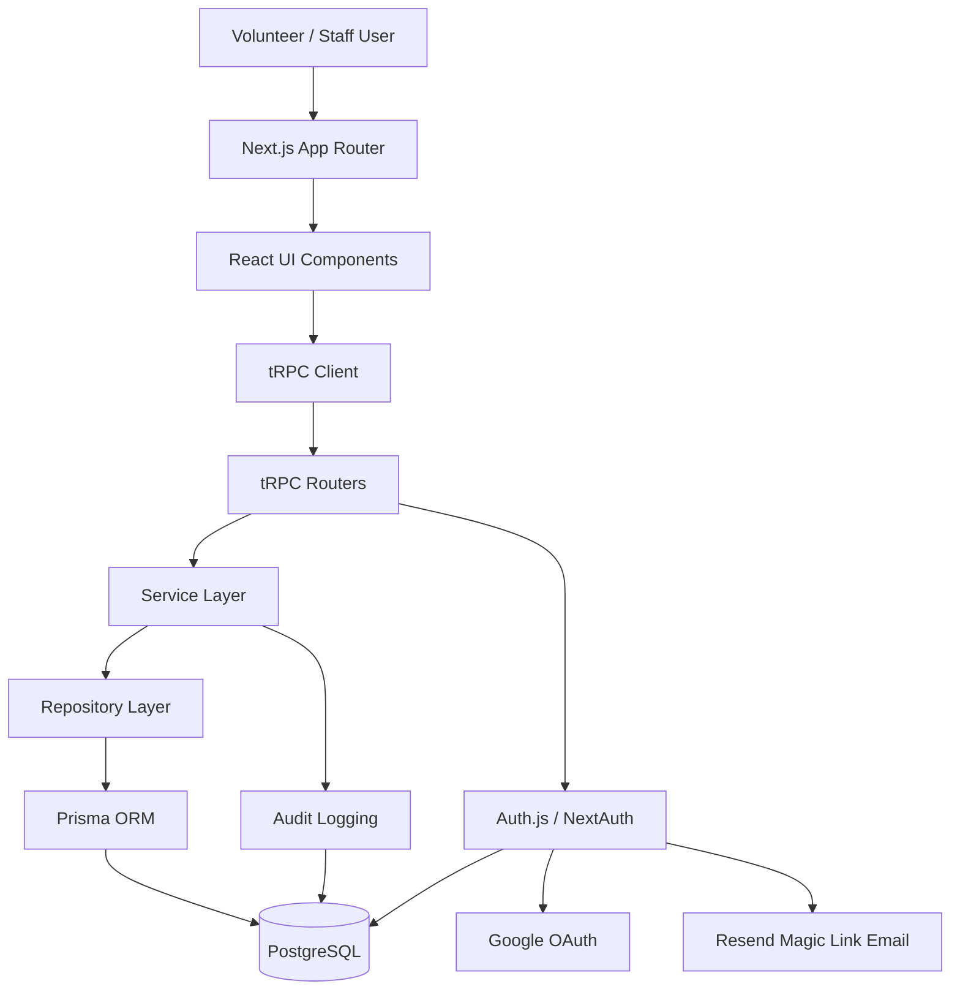
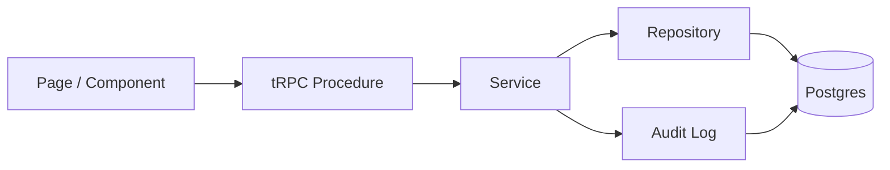
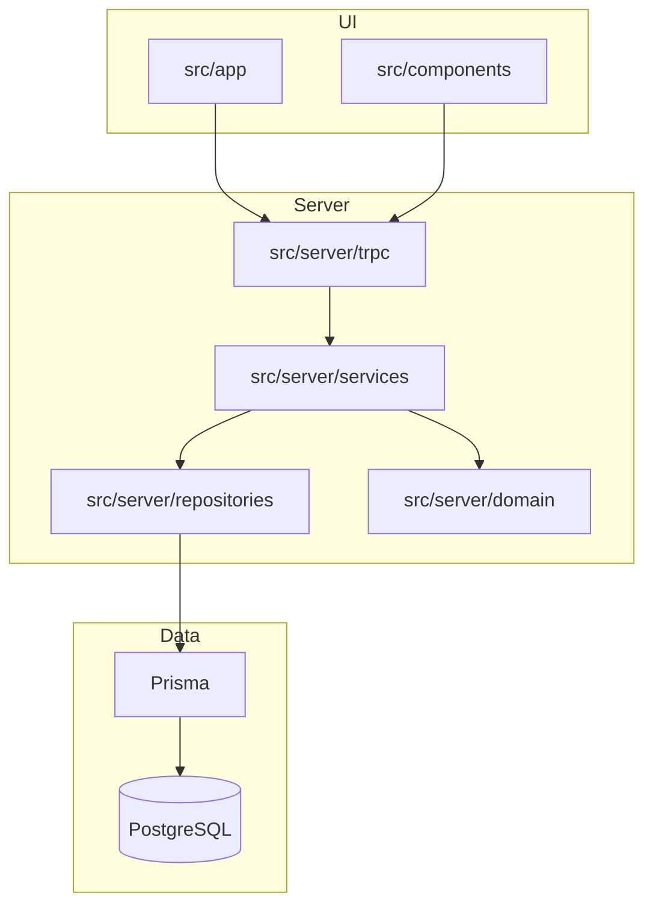
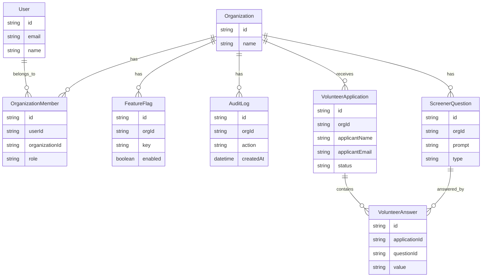
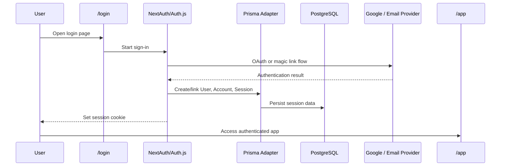
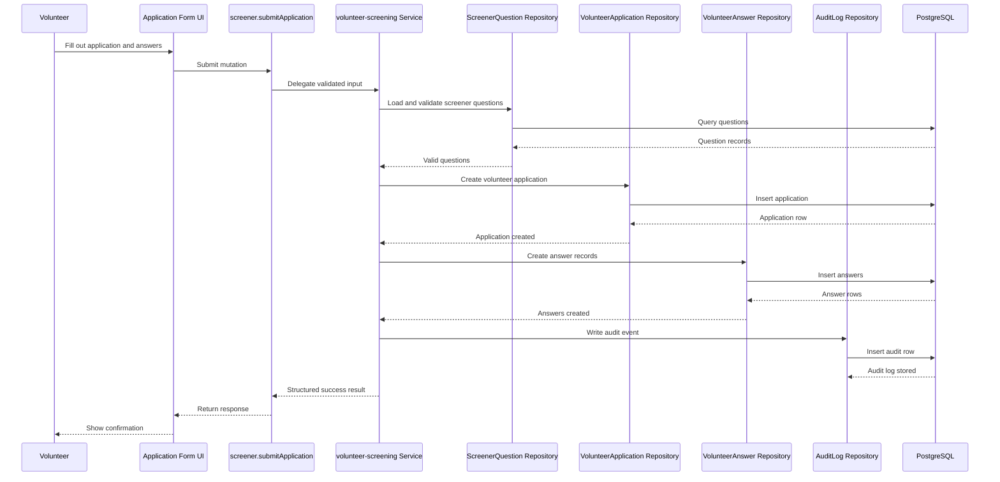
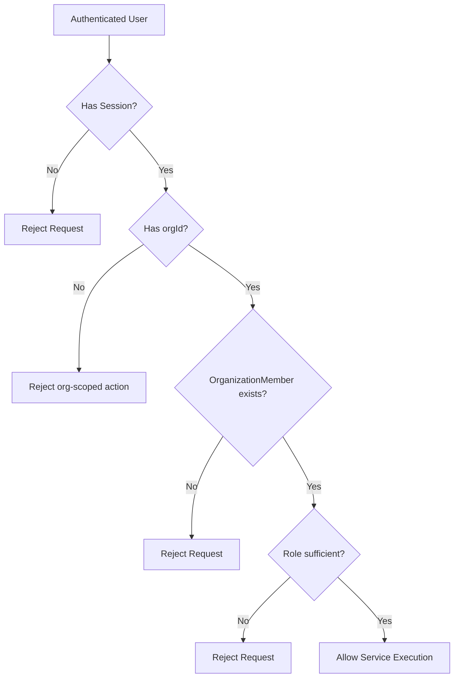
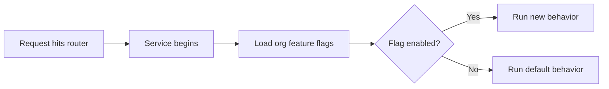
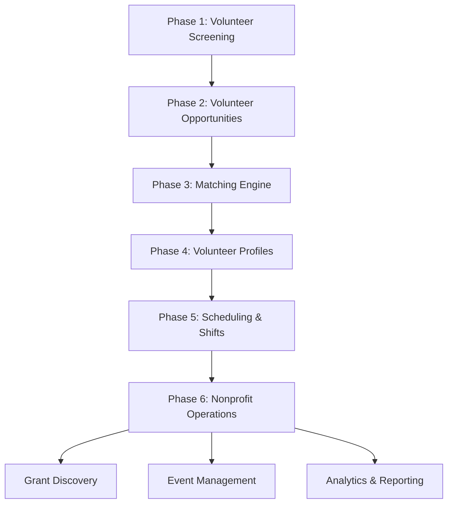

# SYSTEM_DIAGRAM

This document provides a visual overview of the VolunteerReady platform using Mermaid diagrams.

It is intended for:

- human developers onboarding to the project
- AI coding agents that need a visual mental model
- architects making decisions about future modules

VolunteerReady is being built as a multi-tenant nonprofit platform that will expand from volunteer screening into a larger VolunteerMatch-style ecosystem.

---

# 1. High-Level System Architecture

## Notes

- The UI should never talk directly to the database.
- tRPC routers are entry points, not workflow engines.
- Services contain business logic and orchestration.
- Repositories contain Prisma queries and persistence concerns.
- Authentication is handled via NextAuth/Auth.js with database sessions.

---

# 2. Layered Request Flow

## Intent

This is the default request pattern for most features in the system.

Use this flow unless there is a compelling reason not to.

---

# 3. Repository Structure and Responsibility Boundaries

## Boundary Rules

- `src/app/**` handles routing and page composition.
- `src/components/**` contains reusable UI pieces.
- `src/server/trpc/**` contains routers and procedures only.
- `src/server/services/**` contains workflows and business orchestration.
- `src/server/repositories/**` contains Prisma access only.
- `src/server/domain/**` contains pure types, invariants, and helper logic.

---

# 4. Core Multi-Tenant Domain Model

## Important Invariants

- `Organization` is the tenant boundary.
- Users may belong to multiple organizations.
- `OrganizationMember` is unique per `(organizationId, userId)`.
- `FeatureFlag` is unique per `(orgId, key)`.
- `AuditLog` is append-only.

---

# 5. Authentication and Authorization Flow

## Auth Rules

- `/app/*` must be protected.
- `protectedProcedure` requires a valid session.
- `orgProcedure` requires session plus active organization context.
- `adminProcedure` requires `ADMIN` or `OWNER`.

---

# 6. Volunteer Application Submission Flow

## Design Intent

This is the canonical example of how workflows should move through the stack:

- router validates
- service orchestrates
- repositories persist
- audit logs are written explicitly

---

# 7. Organization Access Control Model

## Security Intent

Any org-scoped action should enforce:

1. authenticated user
2. active organization context
3. organization membership
4. role check when applicable

If any of those are skipped, the feature is likely insecure.

---

# 8. Feature Flag Evaluation Flow

## Use Cases

Feature flags should be used for:

- gradual rollout
- premium features
- experimental modules
- per-org capability toggles

---

# 9. Future Platform Expansion Map

## Strategic Meaning

The current codebase should be treated as a platform foundation, not a one-off app.

New features should be added in ways that support these future modules without requiring a rewrite.

---

# 10. Agent Guidance

When generating code for this repository, prefer the design that is:

- explicit
- org-safe
- modular
- service-oriented
- easy to extend later

If unsure where code belongs:

- page composition -> `src/app/**`
- reusable UI -> `src/components/**`
- input/API entry -> `src/server/trpc/**`
- business workflow -> `src/server/services/**`
- database access -> `src/server/repositories/**`
- pure logic/types -> `src/server/domain/**`

The wrong default is usually:
- putting business logic in routers
- putting Prisma everywhere
- forgetting org scoping
- inventing parallel architecture patterns
