# SYSTEM_DIAGRAM

This document provides a visual overview of the VolunteerReady platform using Mermaid diagrams.

It is intended for:

- human developers onboarding to the project
- AI coding agents that need a visual mental model
- architects making decisions about future modules

VolunteerReady is a multi-tenant nonprofit platform that connects volunteers, nonprofits, and corporate employers.

---

# 1. High-Level System Architecture

```mermaid
flowchart TD
    A[Volunteer / Staff / Corporate User] --> B[Next.js App Router]
    B --> C[React UI Components]
    C --> D[tRPC Client]
    D --> E[tRPC Routers]
    E --> F[Service Layer]
    F --> G[Repository Layer]
    G --> H[Prisma ORM]
    H --> I[(PostgreSQL)]

    F --> J[Audit Logging]
    J --> I

    E --> K[Auth.js / NextAuth]
    K --> I

    K --> L[Google OAuth]
    K --> M[Resend Magic Link Email]

    F --> N[Checkr API]
    F --> O[Stripe API]
    F --> P[Resend Email API]

    N -.->|Webhooks| Q[/api/checkr/webhook]
    O -.->|Webhooks| R[/api/stripe/webhook]

    Q --> F
    R --> F

    S[Vercel Cron] -.->|Daily 03:00 UTC| T[/api/cron/expire-credentials]
    T --> F
```

## Notes

- The UI should never talk directly to the database.
- tRPC routers are entry points, not workflow engines.
- Services contain business logic and orchestration.
- Repositories contain Prisma queries and persistence concerns.
- Authentication is handled via NextAuth/Auth.js with database sessions.
- External services (Checkr, Stripe) communicate via webhooks processed through service layer.

---

# 2. Layered Request Flow

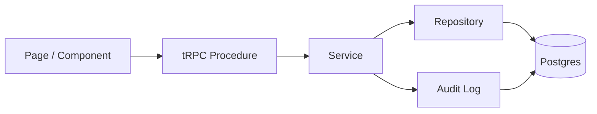

## Intent

This is the default request pattern for most features in the system.

Use this flow unless there is a compelling reason not to.

---

# 3. Repository Structure and Responsibility Boundaries

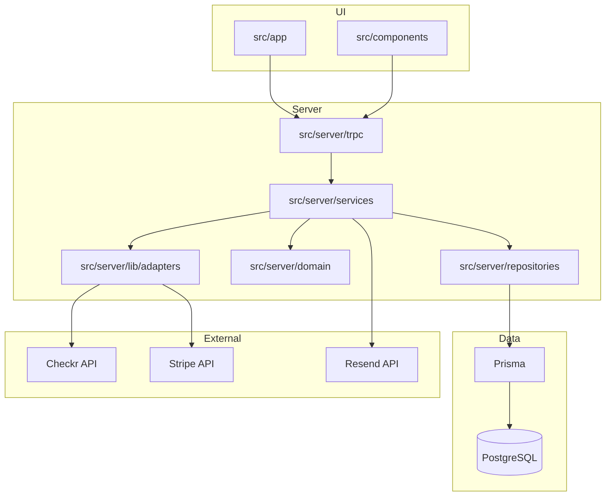

## Boundary Rules

- `src/app/**` handles routing and page composition.
- `src/components/**` contains reusable UI pieces.
- `src/server/trpc/**` contains routers and procedures only.
- `src/server/services/**` contains workflows and business orchestration.
- `src/server/repositories/**` contains Prisma access only.
- `src/server/domain/**` contains pure types, invariants, and helper logic.
- `src/server/lib/adapters/**` wraps external service APIs behind interfaces.

---

# 4. Core Multi-Tenant Domain Model

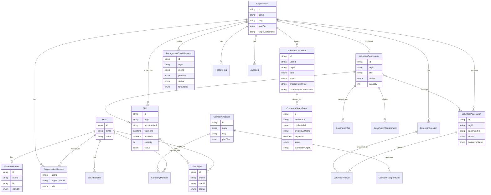

## Important Invariants

- `Organization` is the tenant boundary for nonprofit data.
- `CompanyAccount` is the tenant boundary for corporate data.
- Users may belong to multiple organizations and companies.
- `OrganizationMember` is unique per `(organizationId, userId)`.
- `VolunteerCredential` is unique per `(userId, orgId, type)`.
- `ShiftSignup` is unique per `(shiftId, userId)`.
- `FeatureFlag` is unique per `(orgId, key)`.
- `AuditLog` is append-only.

---

# 5. Authentication and Authorization Flow

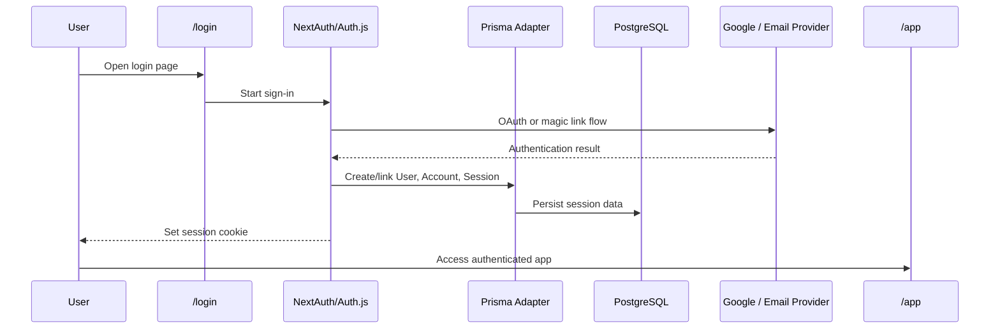

## Auth Rules

- `/app/*` must be protected.
- `protectedProcedure` requires a valid session.
- `orgProcedure` requires session plus active organization context.
- `staffProcedure` requires STAFF, ADMIN, or OWNER role.
- `adminProcedure` requires ADMIN or OWNER.
- `companyProcedure` requires company membership.
- `planTierProcedure(tier)` requires org plan at or above specified tier.

---

# 6. Volunteer Application Submission Flow

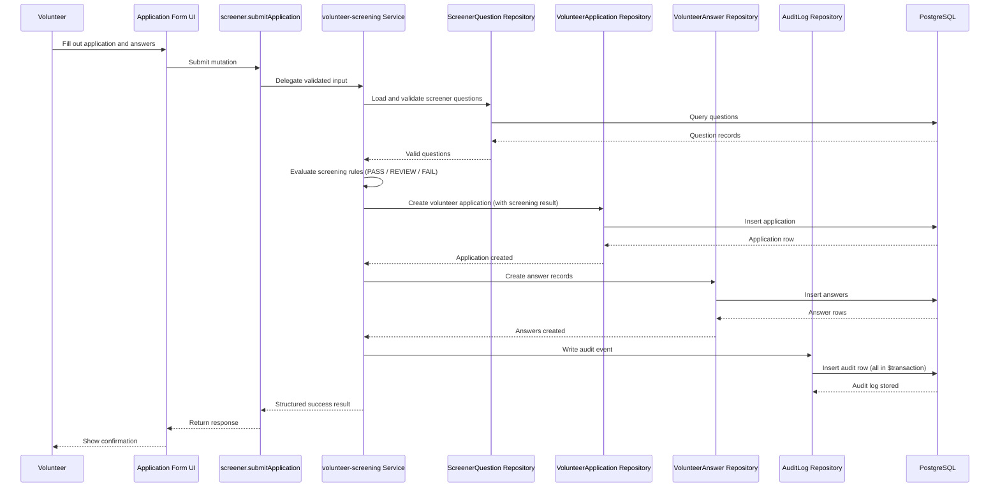

---

# 7. Background Check Lifecycle

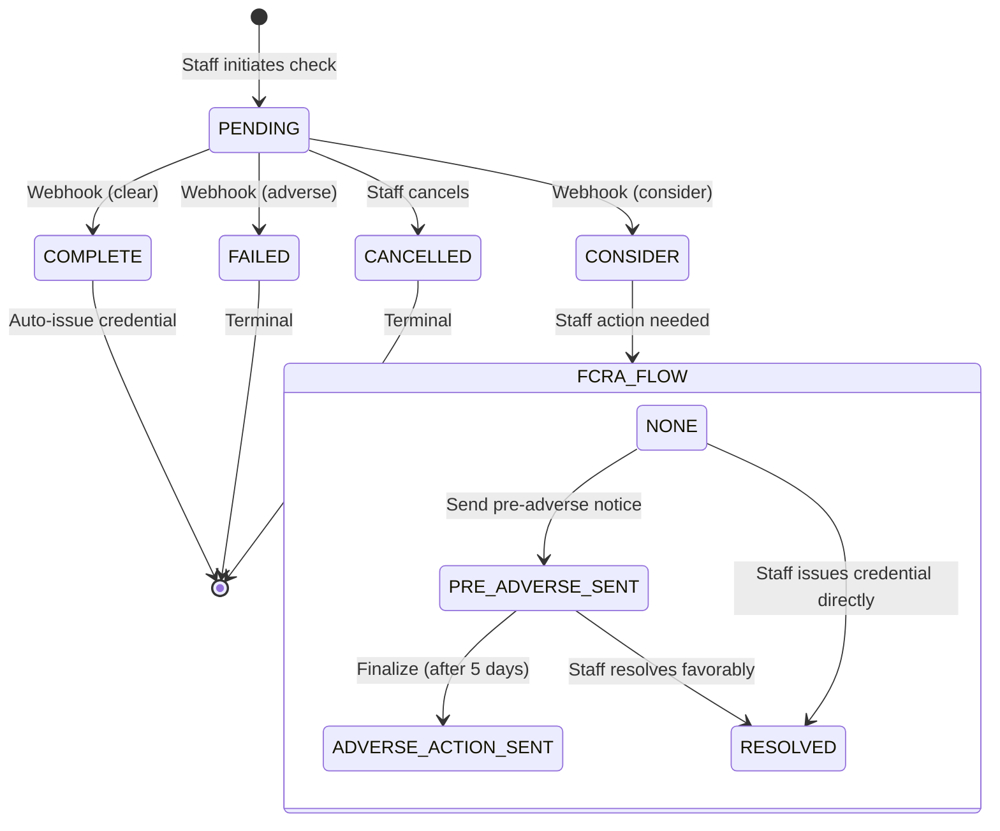

---

# 8. Credential Share Token Lifecycle

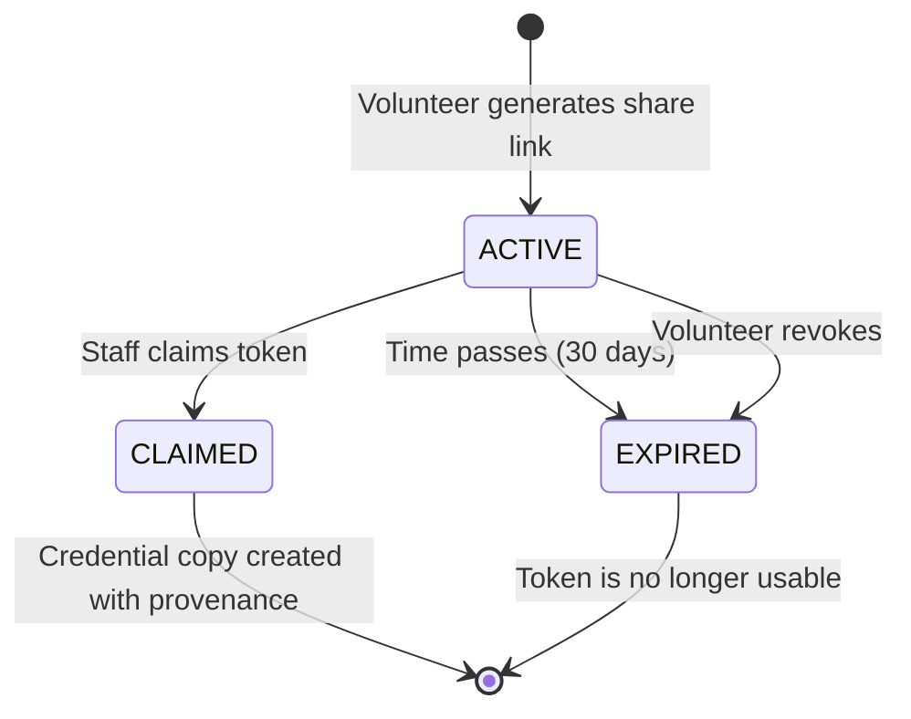

---

# 9. Billing / Plan Tier Flow

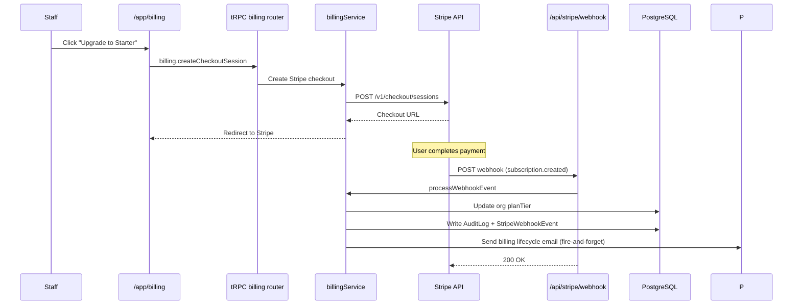

---

# 10. Organization Access Control Model

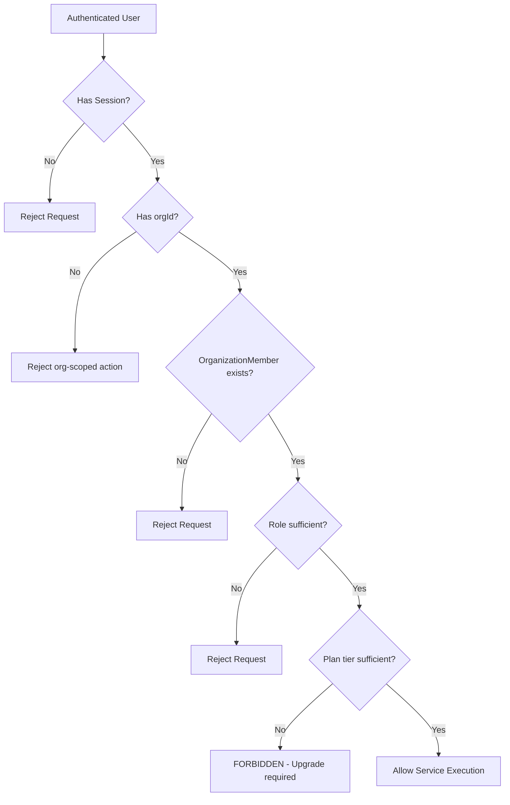

## Security Intent

Any org-scoped action should enforce:

1. authenticated user
2. active organization context
3. organization membership
4. role check when applicable
5. plan tier check when applicable

If any of those are skipped, the feature is likely insecure.

---

# 11. Feature Flag Evaluation Flow

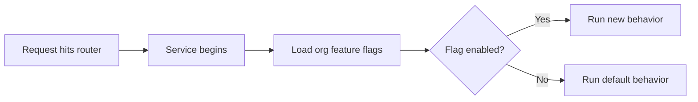

## Use Cases

Feature flags should be used for:

- gradual rollout
- premium features
- experimental modules
- per-org capability toggles

---

# 12. Platform Phase Map

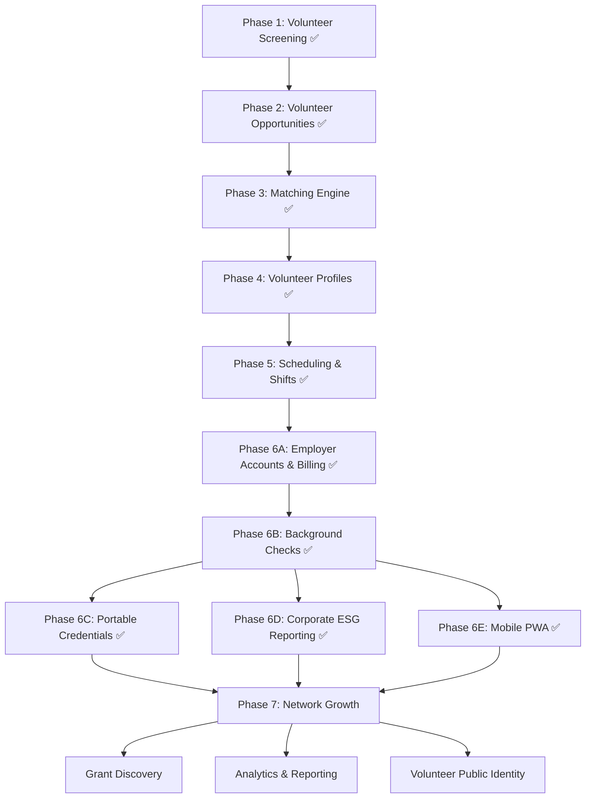

---

# 13. Agent Guidance

When generating code for this repository, prefer the design that is:

- explicit
- org-safe
- modular
- service-oriented
- easy to extend later

If unsure where code belongs:

- page composition -> `src/app/**`
- reusable UI -> `src/components/**`
- input/API entry -> `src/server/trpc/**`
- business workflow -> `src/server/services/**`
- database access -> `src/server/repositories/**`
- pure logic/types -> `src/server/domain/**`
- external API wrappers -> `src/server/lib/adapters/**`

The wrong default is usually:
- putting business logic in routers
- putting Prisma everywhere
- forgetting org scoping
- inventing parallel architecture patterns
- storing PII in the database
